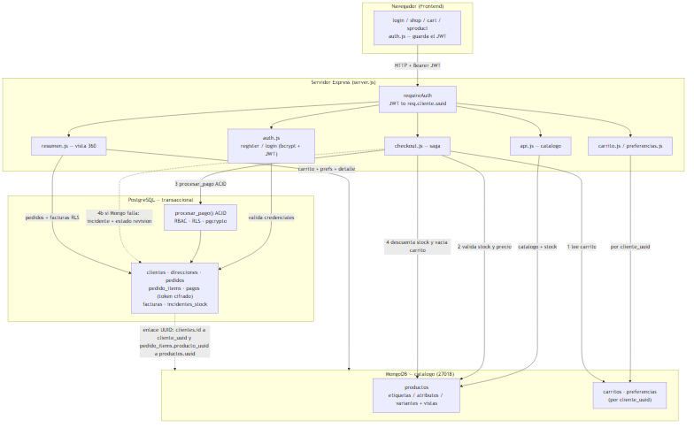
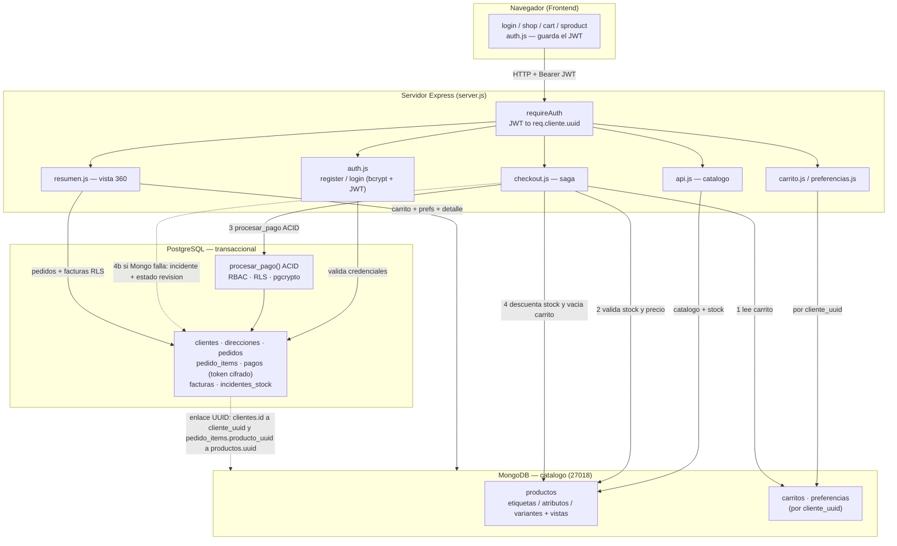
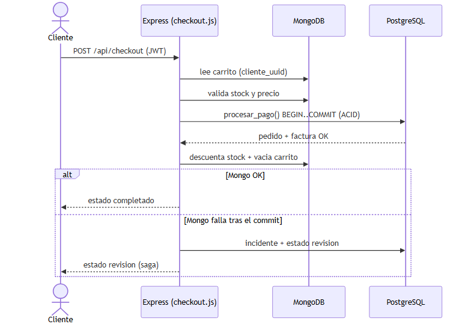
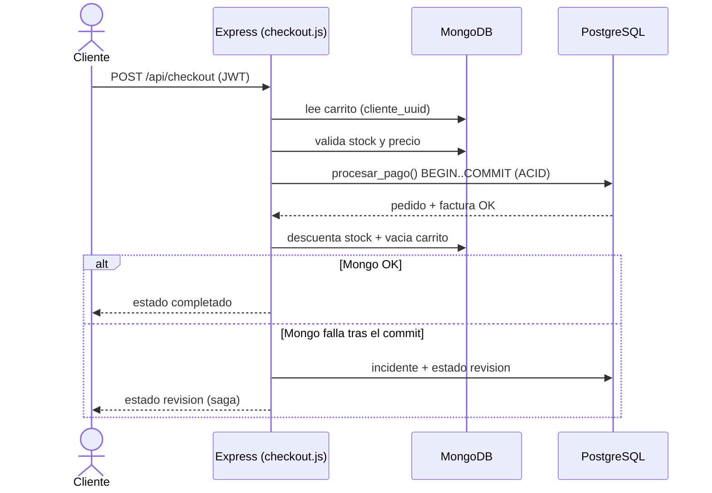

# Arquitectura — Persistencia políglota (PostgreSQL + MongoDB)

Este documento describe la arquitectura de datos del e-commerce: un modelo de
**persistencia políglota** donde lo **transaccional** vive en PostgreSQL y el
**catálogo** (más carrito y preferencias) vive en MongoDB, enlazados por **UUID**.

---

## 1. Diagrama de flujo de datos

Fuente Mermaid del diagrama

---

## 2. Diagrama de secuencia — checkout (saga)

Fuente Mermaid del diagrama

---

## 3. Por qué cada motor

### PostgreSQL para lo transaccional (clientes, pedidos, pagos, facturas)
Los datos transaccionales exigen **integridad fuerte y garantías ACID**:

- **Transacciones ACID**: una compra debe crear pedido + items + pago + factura de
  forma **atómica**. Si algo falla, se revierte todo. Esto se implementa en la
  función PL/pgSQL `procesar_pago()` (un fallo a mitad → ROLLBACK total).
- **Relaciones e integridad referencial**: claves foráneas entre clientes → pedidos
  → items / pagos / facturas, en **3NF** (columnas atómicas, sin dependencias
  transitivas; los importes derivados son columnas GENERATED).
- **Seguridad**: control de acceso por filas/columnas (**RBAC + RLS**) y **cifrado**
  del token de tarjeta con `pgcrypto` (nunca se guarda PAN/CVC en claro).

Un motor relacional es el adecuado: los datos son altamente estructurados, con
relaciones fijas y necesidad de consistencia inmediata.

### MongoDB para el catálogo (y carrito/preferencias)
El catálogo es semiestructurado y se beneficia de un **esquema flexible**:

- **Documentos con esquema dinámico**: cada producto tiene `atributos` distintos
  según su `tipo` (skate → `{soporte_tobillo, durabilidad}`, running → `{drop_mm,
  amortiguacion}`, etc.) — algo incómodo en columnas relacionales.
- **Arreglos ricos**: `etiquetas`, `generos`, `colores`, `colaboraciones`,
  `industria`, `variantes` ([{talla, stock}]). Se consultan con `$in`, `$elemMatch`.
- **Vistas** (`db.createView`) para reportes por etiqueta/comparación.
- **Carrito y preferencias** por `cliente_uuid`: documentos que cambian a menudo y no
  requieren joins transaccionales; encajan natural en colecciones por cliente.
- El **stock autoritativo** vive aquí (junto al catálogo), lo que evita la antigua
  divergencia de inventario.

---

## 4. El UUID como enlace entre motores

No hay claves foráneas físicas entre PostgreSQL y MongoDB (son motores distintos).
La integridad cruzada se mantiene en la **capa de aplicación** mediante UUIDs:

| Concepto | En PostgreSQL | En MongoDB | Enlace |
|----------|---------------|------------|--------|
| Cliente | `clientes.id` (UUID, PK) | `carritos.cliente_uuid`, `preferencias.cliente_uuid` | mismo UUID de cliente |
| Producto | `pedido_items.producto_uuid` | `productos.uuid` | mismo UUID de producto |

- Al **loguear**, el UUID del cliente viaja firmado en el **JWT**; cada request fija
  `app.current_cliente = UUID` (vía `SET LOCAL` en transacción) para que **RLS** aísle
  sus datos en Postgres.
- En el **checkout**, cada item lleva el `producto_uuid` (de Mongo) hacia
  `pedido_items` en Postgres, junto con un **snapshot** de nombre y precio.
- En la **vista 360**, la app lee pedidos/facturas en Postgres (por UUID de cliente) y
  resuelve el detalle de cada producto en Mongo (por `producto_uuid`), uniendo ambos
  mundos en una sola respuesta.

---

## 5. Estrategia de consistencia políglota (saga / compensación)

No usamos transacciones distribuidas (2PC) entre Postgres y Mongo. En su lugar, el
checkout aplica un patrón **saga con compensación** en un orden seguro:

1. **Validar antes de cobrar** — se lee el carrito y se valida **stock y precio** en
   Mongo *antes* de tocar Postgres. Si no hay stock, se aborta sin efectos.
2. **Confirmar el cobro (ACID)** — `procesar_pago()` crea pedido + items + pago +
   factura atómicamente en Postgres. Si falla, ROLLBACK total y no se toca Mongo.
3. **Sincronizar Mongo** — tras el COMMIT, se descuenta el stock y se vacía el carrito
   en Mongo. El filtro `{quantity: {$gte: cantidad}}` evita stock negativo por carreras.
4. **Compensar si Mongo falla** — si el paso 3 falla *después* de cobrar, el pago ya
   es válido y no se revierte automáticamente; se **registra un incidente**
   (`incidentes_stock`) y el pedido pasa a estado **`revision`** para resolución manual.

Este orden minimiza el riesgo: lo irreversible (cobro) solo ocurre tras validar, y
cualquier inconsistencia posterior queda **trazada y marcada**, no silenciada.

> Implementación: [services/checkout.js](../services/checkout.js),
> [db/sql/schema.sql](../db/sql/schema.sql) (función `procesar_pago`, tabla
> `incidentes_stock`, RBAC/RLS, `pgcrypto`).
